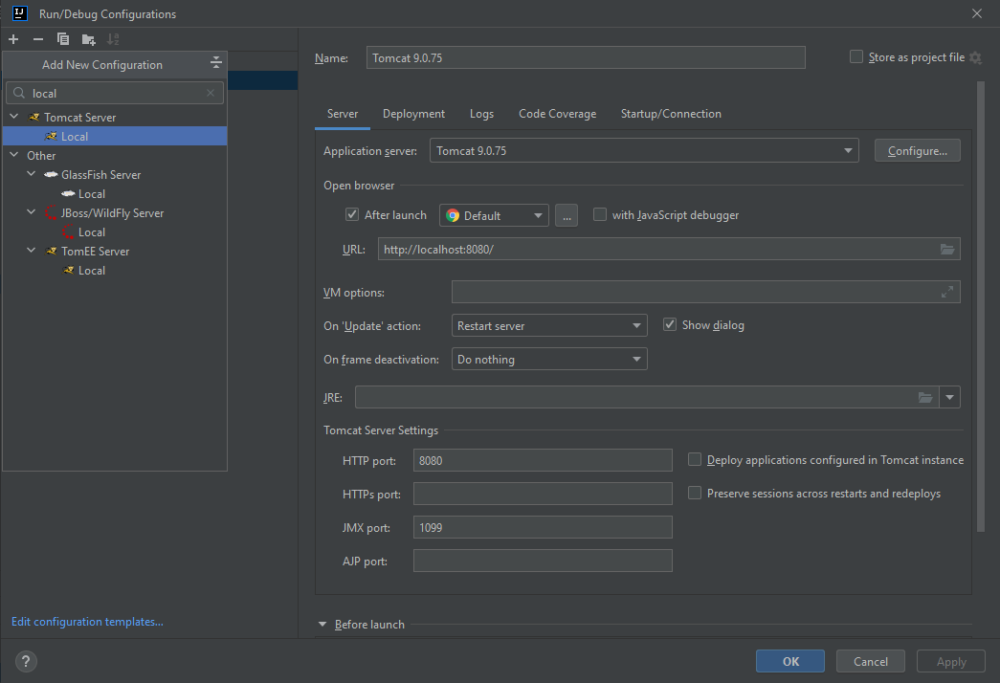
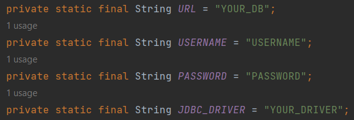

# taxi-service
A project that shows my practical skills in the following things, Java, OOP, SOLID, JDBC, Java Web, JSP, JSTL, as well as SQL was used with relationship building.
# Available functionality:
-register as a driver;
- login as driver;
- create/update/delete a driver;
- display all drivers
- create/update/delete a car;
- display all cars;
- create/update/delete a manufacturer;
- display all manufacturers;
- add a driver to a car;
- display all cars for current login driver;
# Project Structure:
The project uses a multi-level architecture, namely:
- DAO - level for communicating with the database
- Service - level for sending queries to the database, as well as for business logic
- Controller - level of presentation of the user interface, as well as sending requests to the service.
# Technologies:
- Java 11
- JDBC
- JSP
- JSTL 1.2
- Maven 3.1.1
- MySQL 8.0.22
- Servlet API 4.0.1
- Tomcat 9.0.50
# Installation:
1. Fork this project to your repository
2. Press "Code" and choose HTTPS or SSH URL to clone the project
3. Install MySQL
4. Install Apache Tomcat version: 9.0.50
5. Add new Tomcat local server configuration to your project, in Application server field specify the path to your tomcat:

6. Write your properties to ConnectionUtil class in util package:

7. Copy and run SQL script from resources/init_db.sql in order to create a schema and tables for the project
8. Run the project
# Working version:
- AWS: http://taxi-service-app-env.eba-vpsiqkim.eu-north-1.elasticbeanstalk.com/
